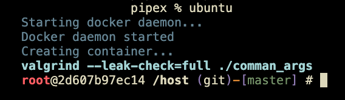

# Easy setup how to run valgrind on Mac in 42 school.

> [!NOTE]
> Docker should be installed in your system.

## Step 1 - Download:
```
git clone https://github.com/flolau2k/Simple-Ubuntu simple_ubuntu
cd simple_ubuntu
chmod +x start.sh
./start.sh
```
Wait for everything to install. First time it takes a bit if time.

## Step 2 - Alias:
Go to your home directory and create alias to run the miniubuntu from any project directory.
For Bash users:
```
cd ~
echo 'alias ubuntu="/Users/YOUR_USER_NAME/simple_ubuntu/start.sh"' >> ~/.bashrc
source ~/.bashrc
```

For Zsh users:
```
cd ~
echo 'alias ubuntu="/Users/YOUR_USER_NAME/simple_ubuntu/start.sh"' >> ~/.zshrc
source ~/.zshrc
```

## Step 3 - Run:
Go to any of your project directory and run:
```
ubuntu
```

And you can run any valgrind commands, like:
```
valgrind --leak-check=full ./comman_and_command_args
```



> [!WARNING]
> I'm a noob regarding this topic, so if something did not work for you correctly, I'm sorry. You can always ask a question and I will try to help you!
